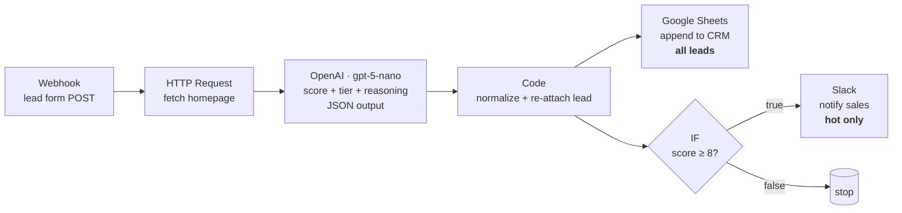

# Tessera — AI Lead Qualification Pipeline (n8n)

An importable [n8n](https://n8n.io) workflow that qualifies inbound B2B leads for
*Tessera*, a fictional B2B SaaS workspace platform. A lead submits your web form;
the workflow enriches the lead with their website homepage, asks an LLM to score
and tier them, logs **every** lead to a CRM sheet, and pings the sales channel on
the **hot** ones — all with no code to deploy or host.

This is a portfolio demo. Credentials (OpenAI, Google Sheets, Slack) are left as
**placeholders** you connect in the n8n UI. Built with [Claude Code](https://claude.com/claude-code).

## What it does

A lead form POSTs `{ name, email, company, website, message }` to a webhook. The
workflow then:

1. **Fetches the lead's homepage** for extra context (see the honest framing note
   below — this is a single homepage GET, not scraping).
2. **Asks gpt-5-nano to qualify** the lead and return strict JSON:
   `{ score: 1-10, tier: hot|warm|cold, reasoning: ≤2 sentences }`.
3. **Normalizes** that output and re-attaches the original lead into one flat item.
4. **Logs every lead** (hot, warm, or cold) to a Google Sheet named `CRM`.
5. **Alerts sales on hot leads only** (`score ≥ 8`) via Slack.

## Architecture



ASCII fallback:

```
Webhook ─▶ HTTP Request ─▶ OpenAI (gpt-5-nano) ─▶ Code (normalize) ─┬─▶ Google Sheets  (all leads)
 lead POST   fetch homepage    score/tier/JSON       flatten+merge   │
                                                                     └─▶ IF score≥8 ─true─▶ Slack (hot only)
                                                                                    └false─▶ (stop)
```

## Node-by-node walkthrough

| # | Node | Type | What it does |
|---|------|------|--------------|
| 1 | **Lead Webhook** | `n8n-nodes-base.webhook` (v2.1) | `POST /webhook/tessera-lead-qualify`. Body arrives at `$json.body`. Responds immediately (`onReceived`) so the form isn't blocked. |
| 2 | **Fetch website homepage** | `n8n-nodes-base.httpRequest` (v4.2) | `GET` the lead's `website`. `Response Format: text` → HTML lands in `$json.data`. `neverError` + node `onError: continueRegularOutput` so a slow/blocked/missing site never kills the run. 15s timeout. |
| 3 | **Qualify lead (gpt-5-nano)** | `@n8n/n8n-nodes-langchain.openAi` (v1.8) | System message = scoring rubric; user message = lead fields + homepage (capped at 3000 chars). **Output Content as JSON** is on, so the response is strict JSON parsed to `$json.message.content`. |
| 4 | **Normalize qualification** | `n8n-nodes-base.code` (v2) | Flattens the LLM output and re-attaches the original lead into one item: `{ name, email, company, website, message, score, tier, reasoning, qualified_at }`. Parses defensively (object *or* string) and clamps `score`/`tier` so a malformed response degrades to `score: 0` instead of throwing. |
| 5 | **Log to CRM (all leads)** | `n8n-nodes-base.googleSheets` (v4.6) | `append` a row to the `CRM` sheet for **every** lead. Columns auto-map to headers matching the field names above. |
| 6 | **IF hot lead (score ≥ 8)** | `n8n-nodes-base.if` (v2.2) | Numeric `≥ 8` on `$json.score` (loose type validation, so `"8"` still compares as a number). True → notify; false → stop. |
| 7 | **Notify sales (hot only)** | `n8n-nodes-base.slack` (v2.3) | Posts score, tier, company, email, and the model's reasoning to your sales channel. Swap for the **Gmail** node if you'd rather email. |

Sticky notes inside the workflow explain each stage on the canvas.

## Import

Requires Node.js. No global install needed — `npx` downloads n8n on first run.

```bash
# import the workflow into your local n8n instance
npx n8n import:workflow --input=workflow.json

# then open the editor to connect credentials and activate
npx n8n start          # editor at http://localhost:5678
```

Or, in the n8n editor UI: **Workflows → ⋯ → Import from File → workflow.json**.

> Validated on **n8n 2.29.10** (Windows) with
> `npx n8n import:workflow --input=workflow.json` →
> `Successfully imported 1 workflow.`

## Credential setup (placeholders you connect)

The workflow imports with no secrets. Open each node and attach a credential:

- **OpenAI** (`Qualify lead` node) — create an *OpenAI* credential with your API key
  (<https://platform.openai.com/api-keys>). The model is set to `gpt-5-nano`; change
  it in the node's **Model** field if you like. Set a spend cap on the key for a
  public demo.
- **Google Sheets** (`Log to CRM` node) — create a *Google Sheets OAuth2* credential,
  then pick your spreadsheet in **Document** and the `CRM` sheet in **Sheet**. Give the
  sheet a header row matching the field names:
  `name | email | company | website | message | score | tier | reasoning | qualified_at`.
  (The node's `documentId` / `sheetName` are placeholders — reselect them in the UI.)
- **Slack** (`Notify sales` node) — create a *Slack API* credential (bot token) and pick
  your channel in **Channel**. The `channelId` is a placeholder (`#leads-hot`).

## Run it for $0 (Gemini free tier)

You can run the whole pipeline without an OpenAI bill by pointing the `Qualify lead`
node at Google Gemini's OpenAI-compatible endpoint instead. n8n's *OpenAI* credential
has a **Base URL** field for exactly this — any OpenAI-compatible API works, no
separate node or credential type needed.

1. **Get a free key.** <https://aistudio.google.com/apikey> — no card required.
2. **Create the credential.** In n8n, add a new *OpenAI* credential (don't reuse the
   paid one):
   - **Name:** `Gemini (free tier)`
   - **API Key:** your AI Studio key
   - **Base URL:** `https://generativelanguage.googleapis.com/v1beta/openai/`
3. **Point the node at a Gemini model.** Open `Qualify lead`, swap the credential to
   the one above, and set **Model** to `gemini-2.5-flash-lite`. The model dropdown
   populates from the endpoint's `/models` list and may not surface Gemini IDs
   cleanly (or at all) — if it doesn't appear, switch the Model field to **Expression**
   and enter `gemini-2.5-flash-lite` directly as a string.
4. **Mind the rate limit.** The free tier is roughly **15 requests/min and 1,000
   requests/day** — fine for manual testing and the five sample payloads, not for a
   live demo hammered with traffic. Space out test POSTs accordingly.
5. **Re-check JSON output.** `Output Content as JSON` is an OpenAI-node setting, not
   a guarantee every compatible backend honors identically — run all five files in
   `sample-payloads/` and confirm `$json.message.content` still parses as clean JSON
   with `score`/`tier`/`reasoning`. The `Normalize qualification` Code node already
   parses defensively (object or string, clamped score), so a rough edge here degrades
   gracefully rather than throwing — but sanity-check it once before trusting the run.
6. **Fallback: Groq.** If Gemini's output shape or rate limit doesn't cooperate, the
   same trick works with Groq's free tier via the same credential mechanism: **Base
   URL** `https://api.groq.com/openai/v1`, **Model** `llama-3.3-70b-versatile`, key
   from <https://console.groq.com/keys>.
7. **Label your metrics.** If you publish throughput/cost/latency numbers from a run
   on Gemini or Groq, label them with the serving model (e.g. "measured on
   `gemini-2.5-flash-lite`, not `gpt-5-nano`") — the numbers in
   [Measured metrics](#measured-metrics) below are not interchangeable across models.

## Test it

Start the workflow (Execute or Activate), then POST a sample lead:

```bash
curl -X POST http://localhost:5678/webhook-test/tessera-lead-qualify \
  -H "Content-Type: application/json" \
  --data @sample-payloads/01-hot-enterprise.json
```

Use `/webhook/...` (not `/webhook-test/...`) once the workflow is **active**.
The `sample-payloads/` folder has five realistic bodies spanning the tiers:

| File | Expected tier |
|------|---------------|
| `01-hot-enterprise.json` | hot — 400-person firm, clear intent, 50+ seats |
| `02-hot-startup.json` | hot — funded startup, approved budget, whole org |
| `03-warm-smb.json` | warm — small studio, just browsing, price-sensitive |
| `04-warm-unclear.json` | warm — real org but vague, non-committal intent |
| `05-cold-personal.json` | cold — free Gmail, no company, personal to-do use |

(Tiers are the model's call at run time — the labels above are the design intent.)

## Measured metrics

> Throughput and per-lead cost are **measured at record time — no invented numbers.**
> Fill this in from a real run before showing the demo:
>
> - Model: `gpt-5-nano`
> - Avg tokens per lead (in / out): _measure_
> - Avg cost per lead: _measure_
> - End-to-end latency (webhook → Slack): _measure_
> - Homepage-fetch success rate across the sample payloads: _measure_

## Honest framing — "enrichment", not scraping

The enrichment step is a **single HTTP GET of the lead's own homepage**. It is not
anti-bot scraping: no headless browser, no proxy rotation, no crawling of internal
pages, no attempt to defeat rate limits or `robots` controls. If the site is slow,
blocks the request, or the lead left `website` blank, the fetch simply returns
empty and the model qualifies on the form fields alone. Treat the homepage as a
best-effort context signal, not a guaranteed data source.

## Files

```
workflow.json           the importable n8n workflow
README.md               this file
DECISIONS.md            load-bearing engineering tradeoffs
sample-payloads/        five realistic lead POST bodies (hot / warm / cold)
```

See [`DECISIONS.md`](./DECISIONS.md) for why n8n over code, why structured-JSON +
IF over an AI Agent node, the enrichment scope, and the webhook-security note.
